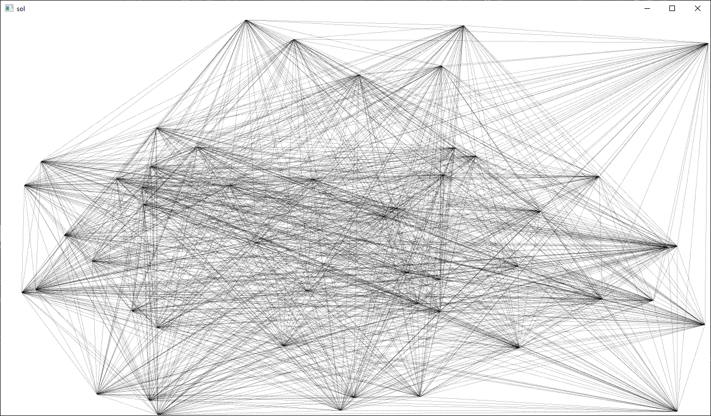

[](https://opensource.org/licenses/BSD-3-Clause)

tinygfx
=======
Small experiments with graphics programming.


Examples
========





Building
========
CMake Build Options
-------------------
* TINYGFX_ENABLE_COVERAGE - Enable code coverage
* TINYGFX_BUILD_EXAMPLES - Build examples
* TINYGFX_BUILD_TESTS - Build tests

Building on Linux
-----------------
Clone the repository:
```
git clone https://github.com/darbyjohnston/tinygfx.git
cd tinygfx
```
Create a build directory:
```
mkdir build
cd build
```
Run CMake:
```
cmake ..
```
Start the build:
```
cmake --build . -j 4 --config Debug
```
Try running the "gol" example:
```
examples/gol/gol
```

Building on macOS
-----------------
Clone the repository:
```
git clone https://github.com/darbyjohnston/tinygfx.git
cd tinygfx
```
Create a build directory:
```
mkdir build
cd build
```
Run CMake:
```
cmake ..
```
Start the build:
```
cmake --build . -j 4 --config Debug
```
Try running the "gol" example:
```
examples/gol/gol
```

Notes for building on macOS
---------------------------
The CMake variable "CMAKE_OSX_ARCHITECTURES" can be used to specify the build
architecture:
```
-DCMAKE_OSX_ARCHITECTURES=x86_64
```
```
-DCMAKE_OSX_ARCHITECTURES=arm64
```

Building on Windows
-------------------
Clone the repository:
```
git clone https://github.com/darbyjohnston/tinygfx.git
cd tinygfx
```
Create a build directory:
```
mkdir build
cd build
```
Run CMake:
```
cmake ..
```
Start the build:
```
cmake --build . -j 4 --config Debug
```
Try running the "gol" example:
```
examples\gol\Debug\gol
```
